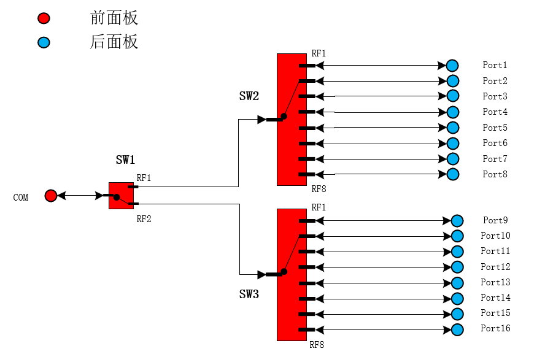

PinProbe M1I下位机 指令说明

## 链路图

## 基础指令

| 指令    | 参数 | 说明         |
| ------- | ---- | ------------ |
| `*IDN?` |      | 查询链路箱ID |
| `*WAI`  |      | 等待指令完成 |
| `*OPC?` |      | 查询指令完成 |

## 链路控制指令

| 指令                    | 参数                                                                                  | 说明         |
| ----------------------- | ------------------------------------------------------------------------------------- | ------------ |
| `CONFigure:LINK `       | [参数说明](#%E9%93%BE%E8%B7%AF%E6%8E%A7%E5%88%B6%E5%8F%82%E6%95%B0%E8%AF%B4%E6%98%8E) | 配置链路模式 |
| `CONFigure:SWITch# `    | [参数说明](#%E9%93%BE%E8%B7%AF%E6%8E%A7%E5%88%B6%E5%8F%82%E6%95%B0%E8%AF%B4%E6%98%8E) | 单独控制开关 |
| `CONFigure:CYLinder# `  | [参数说明](#%E9%93%BE%E8%B7%AF%E6%8E%A7%E5%88%B6%E5%8F%82%E6%95%B0%E8%AF%B4%E6%98%8E) | 单独控制气缸 |
| `CONFigure:LOCK# `      | [参数说明](#%E9%93%BE%E8%B7%AF%E6%8E%A7%E5%88%B6%E5%8F%82%E6%95%B0%E8%AF%B4%E6%98%8E) | 单独控制锁定 |
| `CONFigure:LED# `       | [参数说明](#%E9%93%BE%E8%B7%AF%E6%8E%A7%E5%88%B6%E5%8F%82%E6%95%B0%E8%AF%B4%E6%98%8E) | 单独控制LED  |
| `READ:LINK:STATe?`      | [返回值](#%E9%93%BE%E8%B7%AF%E6%8E%A7%E5%88%B6%E5%8F%82%E6%95%B0%E8%AF%B4%E6%98%8E)   | 查询链路配置 |
| `READ:CYLinder#:STATe?` | [返回值](#%E9%93%BE%E8%B7%AF%E6%8E%A7%E5%88%B6%E5%8F%82%E6%95%B0%E8%AF%B4%E6%98%8E)   | 查询气缸配置 |
| `READ:LOCK#:STATe?`     | [返回值](#%E9%93%BE%E8%B7%AF%E6%8E%A7%E5%88%B6%E5%8F%82%E6%95%B0%E8%AF%B4%E6%98%8E)   | 查询锁定配置 |
| `READ:LED#:STATe?`      | [返回值](#%E9%93%BE%E8%B7%AF%E6%8E%A7%E5%88%B6%E5%8F%82%E6%95%B0%E8%AF%B4%E6%98%8E)   | 查询LED配置  |
| `READ:SYSTEM:STATe?`    | [返回值](#%E9%93%BE%E8%B7%AF%E6%8E%A7%E5%88%B6%E5%8F%82%E6%95%B0%E8%AF%B4%E6%98%8E)   | 查询系统状态 |

### 可选链路配置

* `Port1`
  * 输出口处于Port1
* `Port2`
  * 输出口处于Port2
* `Port3`
  * 输出口处于Port3
* `Port4`
  * 输出口处于Port4
* `Port5`
  * 输出口处于Port5
* `Port6`
  * 输出口处于Port6
* `Port7`
  * 输出口处于Port7
* `Port8`
  * 输出口处于Port8
* `Port9`
  * 输出口处于Port9
* `Port10`
  * 输出口处于Port10
* `Port11`
  * 输出口处于Port11
* `Port12`
  * 输出口处于Port12
* `Port13`
  * 输出口处于Port13
* `Port14`
  * 输出口处于Port14
* `Port15`
  * 输出口处于Port15
* `Port16`
  * 输出口处于Port16

### 可选气缸配置

* `OPEN`
  * 气缸处于打开状态
* `CLOSE`
  * 气缸处于关闭状态

### 可选LED灯配置

* `GREEN`
  * LED指示灯处于绿色
* `READ`
  * LED指示灯处于红色
* `YELLOW`
  * LED指示灯处于黄色
* `CLOSE`
  * LED指示灯处于关闭状态

### 可选锁定状态

* `ON`
  * 设备处于锁定状态
* `OFF`
  * 设备处于解锁状态

### 系统状态

* `Ready`
  * 系统处于初始状态，可进行测试。
* `Running`
  * 系统处于运行中。
* `Stop`
  * 系统在非初始状态停止运行。
* `Emergency`
  * 系统光栅触发或者急停被按下。

